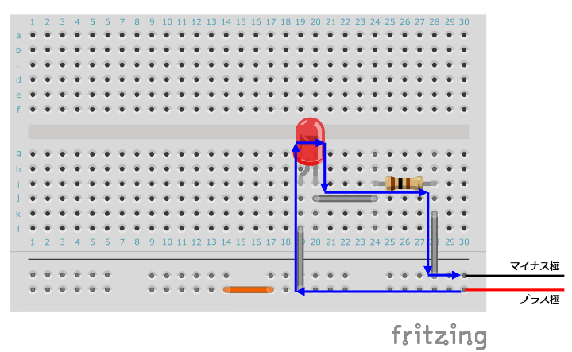

# かけだしロボコニスト　～回路編～

基礎を中心に実用的なプログラミングを学びます  

* [苦しんで覚えるC言語(苦C)](#kairo1)
* [Ardino](#kairo2)
  1. [Aruduino IDEをダウンロード](#kairo3)
  2. [Aruduinoが生きているのか確認する](#kairo4)
  3. [LEDをチカチカ光らせてみる](#kairo5)
  4. [LEDの光の強さを調節してみる](#kairo6)
  5. [【コラム】デジタルとアナログの違い](#kairo7)
  6. [LEDをゆっくり明るくしてみる](#kairo8)
  7. [モータを動かしてみる](#kairo9)
  8. [シリアル通信してみる](#kairo10)
  9. [I2Cしてみる](#kairo11)
   
---
## <a id="kairo1">苦しんで覚えるC言語</a>
[苦しんで覚えるC言語](https://9cguide.appspot.com/)  
13章まで（ポインタの手前）までが理解できれば完璧だと思います  
そこまで出来たら、ポインタについて調べてみるといいかも…？  

---
## <a id="kairo2">Ardiuino</a>
Aruduino（アルディーノ）とは、マイコンの一種。
C言語風の「Arduino言語」によってプログラムを制作・コンパイル・デバッグ等し、それをArduino IDEによってArduinoボードに転送することで使用できる。

緑のボードがAruduino本体  
繋いでいる線が「ジャンパ線」  
白いボードが「ブレッドボード」  
  
部室のどこにあるか確認しておこう！

### <a id="kairo3">Aruduino IDEをダウンロード</a>
[Arduino IDE](https://www.arduino.cc/en/software)にアクセスして自分の使用しているPC（OS）に適切なものをダウンロードしてください。  
最新のバージョン（サイトの一番上）のものをおすすめします。  
  
※ArduinoIDEの日本語はファイル＞環境設定＞Language＞Japaneseで設定できます

ArduinoはArduino言語を使用するので[Arduino 日本語リファレンス](http://www.musashinodenpa.com/arduino/ref/)を見ながらプログラムします。
ブックマークしておきましょう！  

まず、AruduinoIDEを開いてみましょう   
✔ はビルド、➡は書き込みです

### コードの意味
~~~C
 void setup() {  
 //電源が入って一回しか実行しない内容  
  }  
   
 void loop() {  
 //setupを実行した後に無限に繰り返す内容  
 } 
~~~ 

### <a id="kairo4">Arduinoが生きているのか確認する</a>
まずはじめに、自分が使うArduinoが生きているのか確認しましょう。
~~~C
void setup() {
  Serial.begin(9600);	 //シリアル通信の速度を9600bpsに設定
}

void loop() {
  Serial.print("HelloWorld!"); 	//HelloWorld!をシリアルポートへ出力する
  delay(200);　	//200ミリ秒待つ
}
~~~
※[Arduino 日本語リファレンスのシリアル通信](http://www.musashinodenpa.com/arduino/ref/#:~:text=interrupts()%0AnoInterrupts()-,%E3%82%B7%E3%83%AA%E3%82%A2%E3%83%AB%E9%80%9A%E4%BF%A1,-%E4%BB%96%E3%81%AE%E3%82%B3%E3%83%B3%E3%83%94%E3%83%A5%E3%83%BC%E3%82%BF%E3%82%84)　から仕様を確認できます
※「シリアル通信とは」で検索してみましょう

### Arduinoに書き込んでみる
さっき書いたコードをAruduinoに書き込んでみます。  
AruduinoとPCを接続してください。  
ツール＞ボード＞Aruduino AVR Boardsより、AruduinoUNOを選択してください。  
ツール＞シリアルポートからAruduinoUNOがつながっているポートを選択してください。  
チェックのマークを押してエラーが起こらなかったら、矢印マークをおして書き込みましょう。  
ツール＞シリアルモニタを開いてください。    
HelloWorld!HelloWorld!HelloWorld!HelloWorld!のように表示されていれば問題ありません。 

※Serial.print("HelloWorld!");をsetup関数の中に書き込んで実行結果を確認し、最初に実行したものと結果と比較してみましょう！
関数を体感できるかも…　　  
※ビルドに失敗したときは、エラー文を読んでみましょう。誤字脱字が原因かも…  
※誤字脱字が原因でビルドに失敗したわけでなければ、バージョンが使用しているPCに適切ではないのかもしれません。IDEのバージョンを下げてみましょう。  

<a id="kairo5">LEDをチカチカ光らせてみる</a>  
通称「Lチカ」をやってみましょう！！！（LEDチカチカの略）
【ここで必要になる技能】C言語(while:10章)  

参考にするページ  
[pinMode(pin, mode)](http://www.musashinodenpa.com/arduino/ref/index.php?f=0&pos=2014)  
[digitalWrite(pin, value)](http://www.musashinodenpa.com/arduino/ref/index.php?f=0&pos=2051) 

(//の後はコメントアウト)
### 例
~~~
void setup() {
    pinMode( 13, OUTPUT ); //output にする
}
void loop() {
    digitalWrite( 13, HIGH ); //ON
    delay(100);
    digitalWrite( 13, LOW ); //OFF
    delay(300);
}
~~~

